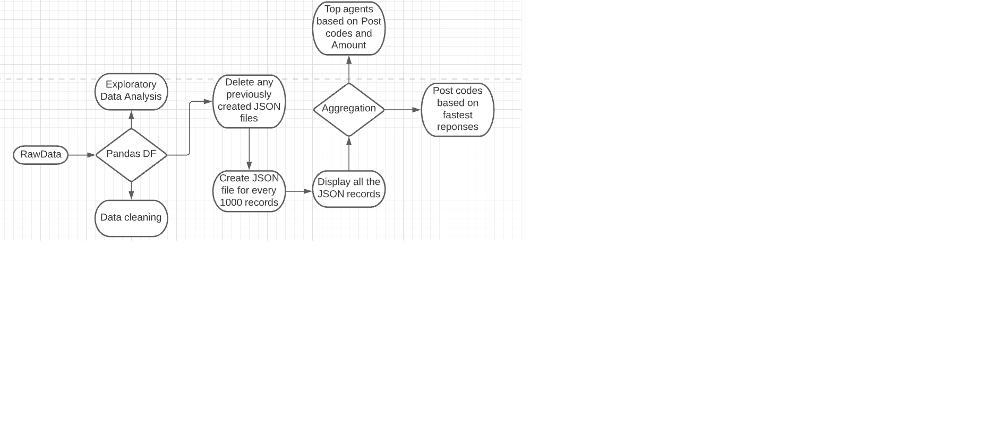

This file contains of 3 files:  
    1. SISU Coding Assessment Instruction.pdf (Instruction manual for the coding test) 
    2. SISU coding test solution.ipynb (note: if you are using PyCharm as you IDE, you might need to convert this file) 
    3. Transaction.csv (The data set provided for the coding test) 
 
IDEs used for this coding test: 
    1. Visual Studio Code 
    2. Jupyter Notebook (In case you don't have this please  visit "https://jupyter.org/install" and follow the instructions) 
 
I chose to use Jupyter Notebook  because of it's user friendly interface and debugging capabilities.  
I chose to work with pandas as it is the most efficient method to work with datasets.  
 
The logic for this script is as follows:
 
1. Four libraries pandas, numpy, os and datetime are used. 
2. The tabular data in csv format is then read into a pandas dataframe. 
3. Unwanted columns are removed, the formats are corrected, NA values are dropped.  
4. The folder is checked if it contains any of the "to be created" files and deleted if they exist. Using the OS library  
5. The tabular data is the written into a JSON file until every 1000th record and then a new batch is initiated. 
6. Response time is then calculated subtracting the implmented date from the requested date. This response time is calculated in days.  
7. Then through groupby and aggregate function a table that shows Post codes with fatest reponse time are displayed.  
8. Finally, using the same transformation and aggregation we get the Top agents based on Post codes and Agents.  

 

